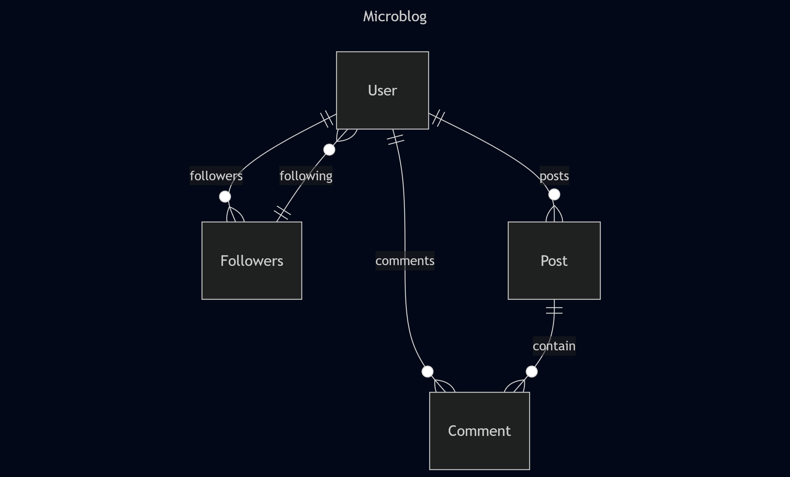

# Microblog

Microblog is a role-based blogging platform built with **Flask 3.1.1**, **SQLAlchemy 2.0.42**, **Bootstrap**, and **SQLite**.  
It allows users to create posts, comment, follow other users, and interact in a simple social environment.  
The platform also provides administrative and analytical tools for managing users, posts, and reports.

## Features

- **Public Access**
  - Explore page available without login (lists all approved posts).

- **User Roles**
  - **User**: Can create posts (requires admin approval), follow other users, and comment on posts.
  - **Admin**: Full control of the system. Can approve posts, manage users, delete posts, and access analytics/reports.
  - **Analyst**: Read-only access to analytics and reporting tools (no user or post management).

- **Posts & Comments**
  - Users can create posts with optional images.
  - Posts require admin approval before appearing on the public feed.
  - Users can comment on posts, with each comment tied to one user and one post.

- **Followers**
  - Users can follow each other to see posts in their personal feed.

- **Admin Dashboard**
  - Manage pending posts, users, and roles.
  - Ensure at least one admin always exists (original admin cannot be deleted).
  - Export posts and user data to CSV.
  - Filter and search for specific posts or users.

- **Role-based Access Control**
  - Access to pages and functionality differs based on role.
  - Single login form for all roles; landing pages differ by role.

## Analytics & Reporting
Microblog provides powerful reporting tools for admins and analysts:

- **Reports**
    - View all posts or users in a searchable and filterable table.
    - Filter posts by status (approved/pending), title, or author.
    - Filter users by role or username.
    - Pagination for large datasets.

- **Analytics**
    - Summary metrics such as:
        - Total posts
        - Pending posts
        - Total users
        - Posts with images
    - Visual representation of user engagement and user activity.

- **Export**
    - Both posts and users can be exported to CSV files.
    - Exports respect applied filters.
    - Admins and analysts can download full datasets for offline analysis.

> ⚠️ Note: Only admins can manage posts, users, and roles. Analysts have read-only access to reporting and analytics.

## Database Structure

The application uses **SQLite** by default with **SQLAlchemy ORM** for database management. 
 
The schema consists of four main tables:

- **User**
  - `id`, `username`, `email`, `password_hash`, `about_me`, `last_seen`, `role`
  - Relationships:
    - One-to-many with **Post**
    - One-to-many with **Comment**
    - Many-to-many (self-referential) via **Followers**

- **Post**
  - `id`, `title`, `body`, `timestamp`, `user_id`, `is_approved`, `image`
  - Relationships:
    - Belongs to one **User**
    - One-to-many with **Comment**

- **Comment**
  - `id`, `body`, `timestamp`, `user_id`, `post_id`
  - Relationships:
    - Belongs to one **User**
    - Belongs to one **Post**

- **Followers**
  - `follower_id`, `following_id`
  - Self-referential relationship enabling users to follow each other

## Installation & Setup

### Prerequisites
- Python **3.10+**
- Virtual environment (recommended)

### Steps

1. **Clone the repository**
   ```bash
   git clone <your-repo-url>
   cd microblog
   ```

2. **Create and activate a virtual environment**
    ```bash
    python3 -m venv venv
    source venv/bin/activate   # On Linux/Mac
    venv\Scripts\activate      # On Windows
    ```

3. **Install dependencies**
    ```bash
    pip install -r requirements.txt
    ```

4. **Initialize the database**
    ```bash
    flask db upgrade
    ```
    > ⚠️ The migrations/ folder already includes the initial migration, so running flask db upgrade is enough. If starting fresh without migrations, run `flask db init` and `flask db migrate -m "Initial migration"` first.

5. **Run the application**
    ```bash
    flask run
    ```

6. **Access the app**
    - Open your browser and go to: http://127.0.0.1:5000/

### Default Credentials
- Username: `admin`
- Password: `admin`
- Email: `admin@example.com`

> ⚠️ The login form is the same for all roles. After logging in, the available pages differ based on the user’s role (User, Analyst, Admin).

## Roles & Permissions

Microblog has three types of users, each with different access levels:

1. **User**
   - Can view the explore page and posts from followed users.
   - Can create posts (require admin approval before being public).
   - Can comment on posts.
   - Can follow or unfollow other users.

2. **Analyst**
   - Has all permissions of a regular user.
   - Can access **Report** and **Analytics** pages with full filtering and CSV export.
   - Cannot manage users or approve posts.

3. **Admin**
   - Has all permissions of an analyst.
   - Can access the **Admin Dashboard**.
   - Can view and approve pending posts.
   - Can view all users and posts.
   - Can create new users with any role (User, Analyst, Admin).
   - Can delete users (except the original admin).
   - Can access **Report** and **Analytics** pages with full filtering and CSV export.

## Project Structure
```
microblog/
├── app/
│ ├── admin/          # Admin blueprints (forms, routes)
│ ├── auth/           # Authentication blueprints
│ ├── main/           # Core app routes and forms
│ ├── models.py       # Database models
│ ├── templates/      # HTML templates
│ └── static/         # CSS, JS, images, uploads
├── migrations/       # Database migration files
├── tests.py          # Test scripts
├── microblog.py      # App entry point
├── requirements.txt
└── config.py
```

## Additional Information
### Virtual Environment
Always run the app inside a virtual environment to manage dependencies safely.

### Database Initialization
Make sure to run `flask db upgrade` before starting the application to create the SQLite database and tables.

### Role-based Access
- Users, analysts, and admins share the same login form.
- After login, the landing page and available features depend on the user’s role.

### Personal / Educational Use
- This project is intended for personal learning and experimentation.
- No license is included.